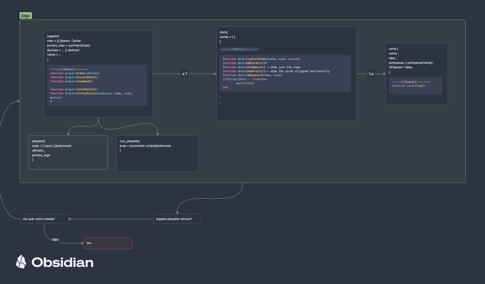
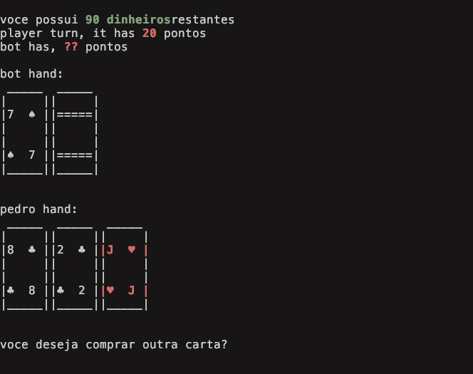

# Blackjack
implementando jogos de carta usando princípios de orientação a objeto



# Blackjack

##### setup
- Primeiro pedimos o nome do jogador e quanto ele deseja apostar.

- Cada jogador compra 2 cartas, e o bot deixa a segunda secreta.


##### turno do jogador

- A decisão do jogador é feita via input: escolher se deseja puxar ou não uma carta.

- Isso se repete até ele decidir parar ou exceder 21 (estourar).

- Caso um Ás seja adicionado à mão, ele vale 11 até o momento em que o jogador exceda 21. Nesse caso, o primeiro Ás encontrado é reduzido para 1, prevenindo o estouro.

##### turno do bot
- A carta secreta do bot é revelada.

- Seguindo as mesmas regras, o bot comprará cartas até pelo menos empatar com o jogador.

##### decidindo vecedor

- A pontuação do jogador deve exceder a pontuação do bot; caso contrário, o jogador perde.

- Se vencer, o valor investido volta multiplicado pela cotação da mesa — que aumenta a cada vitória.

- Se perder, o retorno é 0, e a cotação permanece a mesma.

 ideia foi deixar as interações com o baralho e os jogadores o mais genéricas possível, para que outros jogos pudessem ser implementados utilizando as mesmas estruturas e funções. Porém, por simplicidade, a pontuação das cartas foi deixada fixa para o jogo de Blackjack.
local function pontuacaoCarta() -- regras de pontuação da carta no blackjack
    local pontuacao
    if isJoker then
        pontuacao = 0
    elseif nome == "A" then
        pontuacao = 11 -- podendo valer 1 caso a mão exceda 21
    elseif isRoyalty[nome] then
        pontuacao = 10
    else
        pontuacao = tonumber(nome)
    end
    return pontuacao
end

Toda carta possui nome, naipe e pontuação.
Os naipes são os símbolos { "♠", "♥", "♦", "♣" }, mas o arquivo exporta uma tabela de aliases para que seja possível referir-se a eles externamente:
local nipeAliases = {
    espadas = "♠",
    copas = "♥",
    ouros = "♦",
    paus = "♣",
    coringa = "jkr",
}

E podem ser importados assim:
local playingCards = require("classes.playingCards")
local nipes = playingCards.nipes

A mão dos jogadores é considerada um tipo de deck, porém sem permissão para usar a função fill(), que preencheria o baralho com as 54 cartas completas.
Neste exemplo, os jogadores compartilham um mesmo deck de 52 cartas (sem coringa), mas você pode criar um deck independente usando:
local baralho = playingCards.baralho.newDeck(true, true, true)


## Sobre o codigo
a ideia foi deixar as interaçoes com o baralho e jogadores o mais generica possivel, para que pudessem ser implementados outros jogos utilizando os mesmas estruturas e funçoes, mas a fim de simplicidade, foi deixado a pontuaçao das cartas fixas para o jogo de blackJack
```lua

	local function pontuacaoCarta() --regras pontas carta no blackjack
		local pontuacao
		if isJoker then
			pontuacao = 0
		elseif nome == "A" then
			pontuacao = 11 -- podendo ser 1 caso a mao exceda 21
		elseif isRoyalty[nome] then
			pontuacao = 10
		else
			pontuacao = tonumber(nome)
		end
		return pontuacao
	end
```
```

```

toda carta possui nome, nipe e pontuacao, os nipes sao os simbolos :{ "♠", "♥", "♦", "♣" }, mas é exportada do arquivo uma tabela de aliases para se referir a eles externamente.
```lua
local nipeAliases = {
	espadas = "♠",
	copas = "♥",
	ouros = "♦",
	paus = "♣",
	coringa = "jkr",
}
```

e pode ser importada usando:
```lua

local playingCards = require("classes.playingCards")
local nipes = playingCards.nipes
 ```

a mao dos jogadores é considerada um tipo de deck, mas sem a permissao de usar a funçao `fill()`, que preenche eles com as 54 cartas do baralho.

nesse exemplozinho de codigo, os jogadores compartilham de um mesmo deck de 52 cartas sem o coringa, mas voce pode criar um deck alheio usando:
```lua


local baralho = playingCards.baralho.newDeck(true, true,true)
```

o primeiro booleano para permitir usar a funçao `fill()`, o segundo para tirar os coringas, o terceiro para tirar os J,Q,K do baralho.
